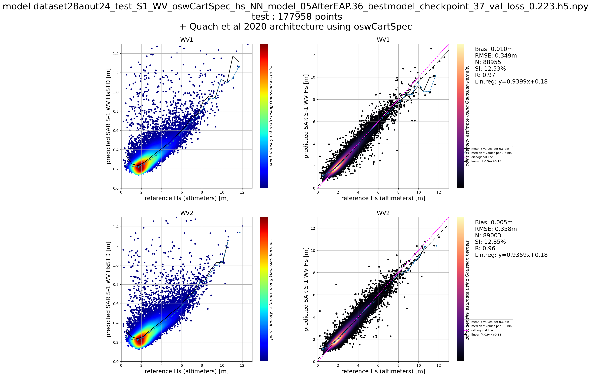
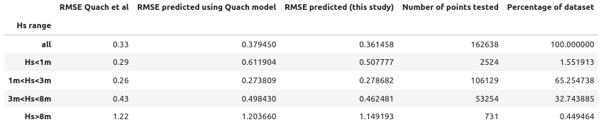
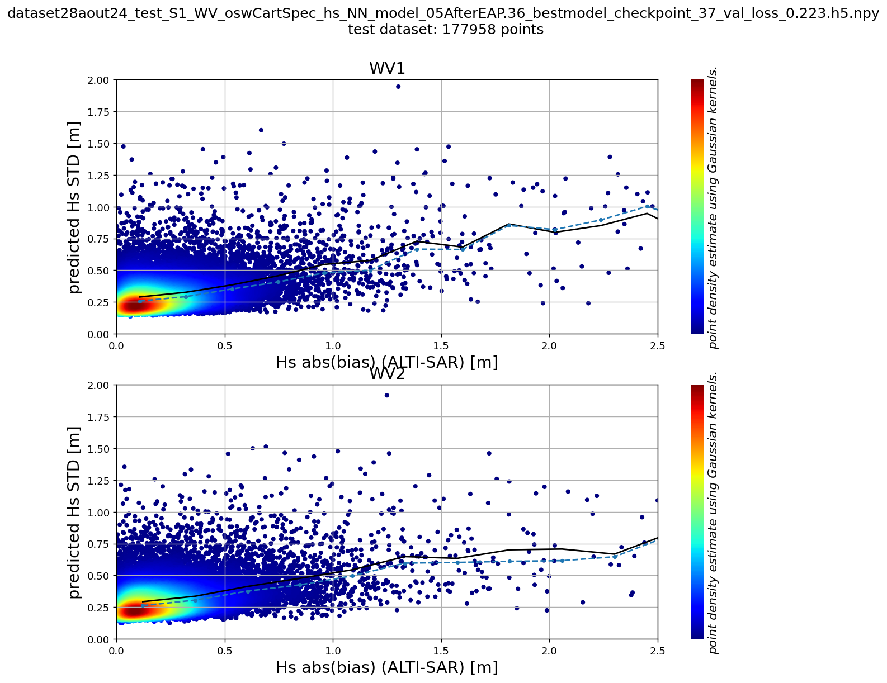
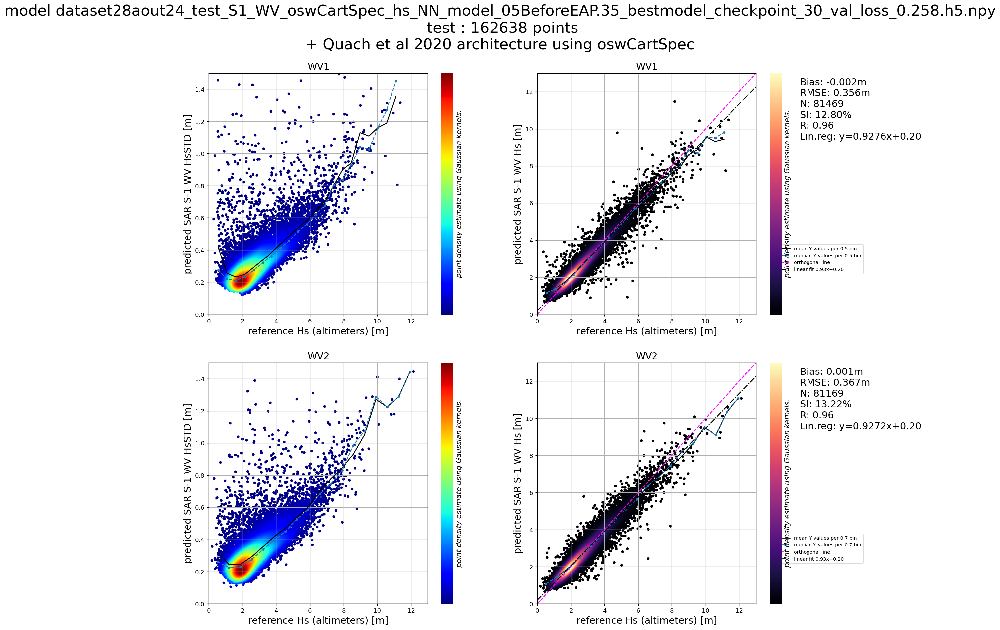
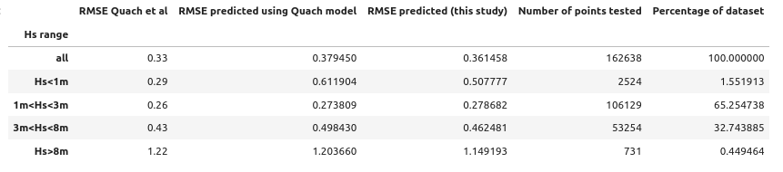
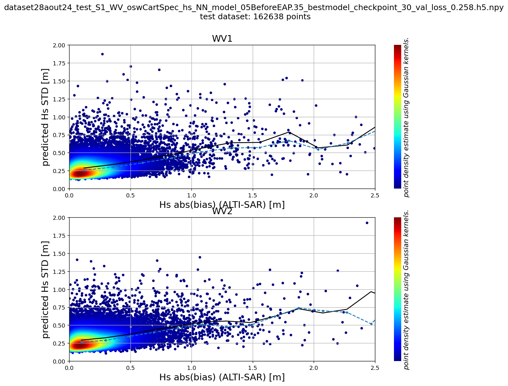

# SAR Hs PREDICTOR

Total Hs (Significant Wave Height) predictor for Sentinel-1 WV OCN product. 

Python library based on `tensorflow`-`keras` to predict altimeter-like significant wave height from radar and cross-spectra derived parameters present in the osw component of OCN WV product generated by ESA.

## Installation

```
pip install -r requirement.txt
pip install .
```
## Configuration [optional]

if one want to test other keras models, a `localconfig.yaml` can be created to superseed the default `config.yaml` file.


## Performances of trained models

The figures below are generated using the test datasets.
### Period after WV2 Elevation Antenna Pattern update ( 26 June 2021 - March 2024)







### Period before WV2 Elevation Antenna Pattern update ( 27 June 2019 - 25 June 2021)





